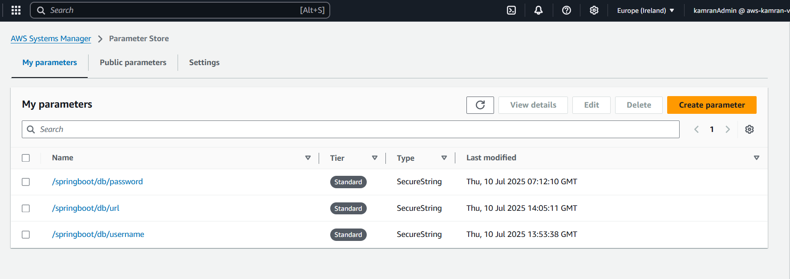
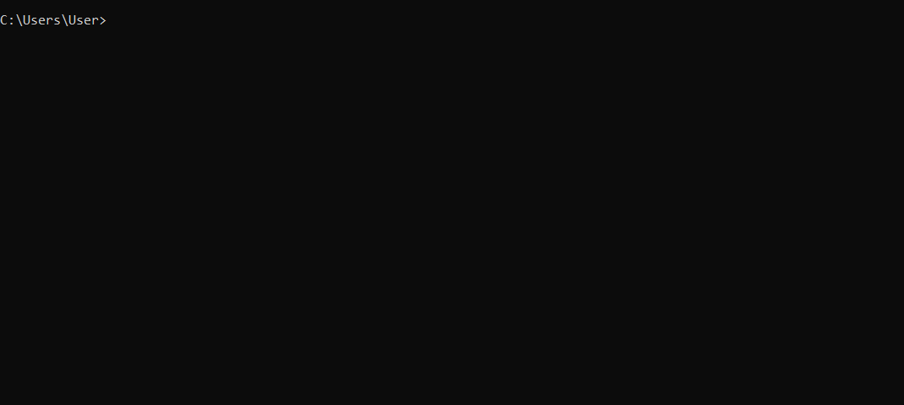
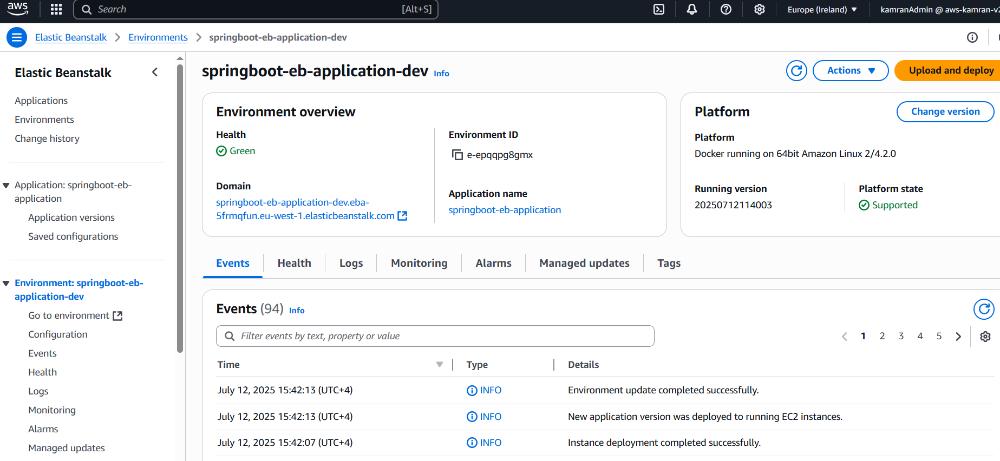
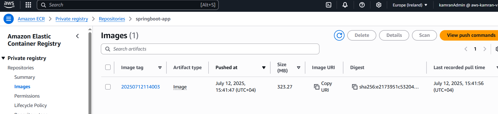
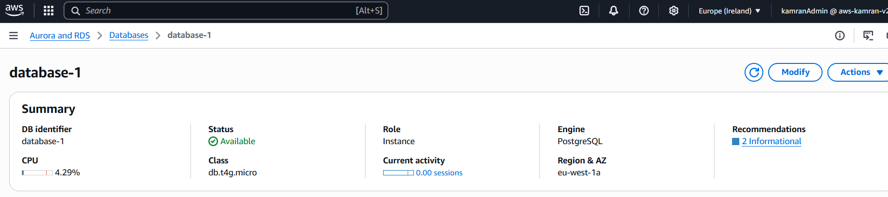
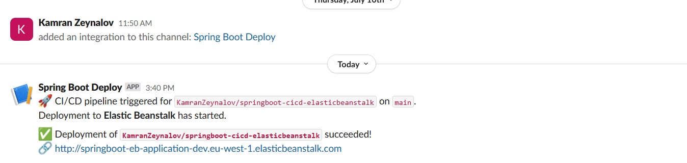

# 🚀 Spring Boot CI/CD with AWS Elastic Beanstalk

> This project is a showcase of real-world CI/CD pipeline automation using GitHub Actions, Docker, and various AWS services — including Elastic Beanstalk, RDS, ECR, Parameter Store, IAM, and Slack integration.  
> Originally started to support partner onboarding, the focus here is not on the application itself but rather on the infrastructure and deployment automation.

---

## 📚 Table of Contents

- [Tech Stack](#-tech-stack)
- [CI/CD Workflow](#️-cicd-workflow)
- [Secrets Management](#-secrets-management)
- [Swagger API Docs](#-swagger-api-docs)
- [Testing](#-testing)
- [Live API Demo (cURL)](#-live-api-demo-curl)
- [Deployment Highlights](#-deployment-highlights)
- [Possible Improvements](#-possible-improvements-future-scope)
- [Contributions](#-contributions)
- [Contact](#-contact)

---

## 🧱 Tech Stack

- **Language:** Java 21
- **Framework:** Spring Boot 3.2.0
- **Containerization:** Docker
- **Database:** PostgreSQL (AWS RDS)
- **CI/CD:** GitHub Actions
- **Cloud Services:**
  - AWS Elastic Beanstalk
  - AWS ECR
  - AWS RDS
  - AWS Systems Manager Parameter Store
  - AWS S3
  - AWS IAM
- **Notifications:** Slack integration via webhook
- **API Docs:** Swagger UI

---

## ⚙️ CI/CD Workflow

### 🔁 Build Workflow (`build.yml`)
Runs on every pull request to `main`:
- Spins up PostgreSQL service
- Builds the project
- Runs JUnit tests

### 🚀 Deployment Workflow (`deploy.yml`)
Triggered on `push` to `main`:
1. Sends Slack notification for deployment start
2. Builds the project and runs tests
3. Builds and pushes Docker image to AWS ECR
4. Creates `Dockerrun.aws.json` and zips it
5. Deploys to AWS Elastic Beanstalk
6. Sends Slack notification on success or failure

---

## 🔐 Secrets Management

- All sensitive values (DB credentials, AWS keys, etc.) are stored in:
  - **AWS Systems Manager Parameter Store**
  - **GitHub Secrets**

---

## 📖 Swagger API Docs

Swagger is integrated for REST API documentation.

Below is a quick walkthrough showing grouped endpoints and example operations.

> This includes:
> - Registering and managing IP addresses
> - Viewing integration requests
> - Manager operations like approving integrations
> - and etc.

---

## 🧪 Testing

- **Frameworks Used:** JUnit
- **DB Setup:** PostgreSQL test DB via GitHub Actions service container
- **Note:** Only a few sample tests are added for demonstration purposes

---

## 🧪 Live API Demo (cURL)

Tested the deployment using terminal `curl` commands to verify end-to-end integration:

---

## 📌 Deployment Highlights

The following screenshots describes end-to-end deployment and configuration.

### ✅ Elastic Beanstalk - Environment Dashboard

### 📦 ECR - Docker Image from CI/CD

### 🗄️ RDS - PostgreSQL Instance

### 🔔 Slack - CI/CD Notifications

---

## 🧭 Possible Improvements (Future Scope)

- Improve testing coverage
- Add user authentication and role-based access
- Integrate monitoring (e.g., CloudWatch, Grafana)

---

## 🤝 Contributions

This is a personal showcase project and not actively maintained for feature completeness. However, feel free to fork it or use parts of it for your own CI/CD workflows.

---

## 📬 Contact

Built by **Kamran Zeynalov**  

---

